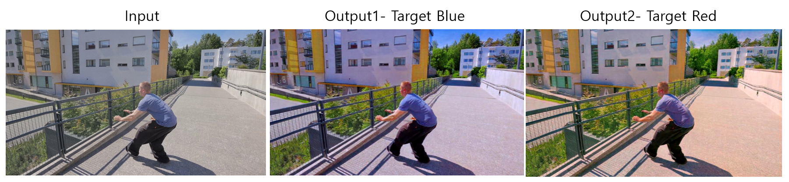

__Personalized Color Enhancement__ is an open source color enhancement technique using deep learning, developed by POSTECH computer graphics laboratory

## Requirement ##

Pytorch 0.4.0

## How to run ##

set the path of dataset/name and run train.py. For example, if you want to train, run
```
python train.py --dataroot /5k_dataset/blue/ --name colorenhance_blue --model colorenhance --pool_size 50 --no_dropout --dataset_mode aligned_rand
```
If you want to test, put a checkpoint file into fixed_ckpt folder and run
```
python test.py --dataroot /5k_dataset/blue/ --name colorenhance_blue --model colorenhance --phase test --no_dropout --dataset_mode aligned_test
```

## Result ##
  

## License ##
This software is being made available under the terms in the [LICENSE](LICENSE) file.

Any exemptions to these terms requires a license from the Pohang University of Science and Technology.

## Useful Links ##

  * [POSTECH CG Lab.](http://cg.postech.ac.kr/)
